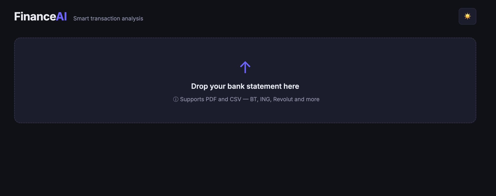
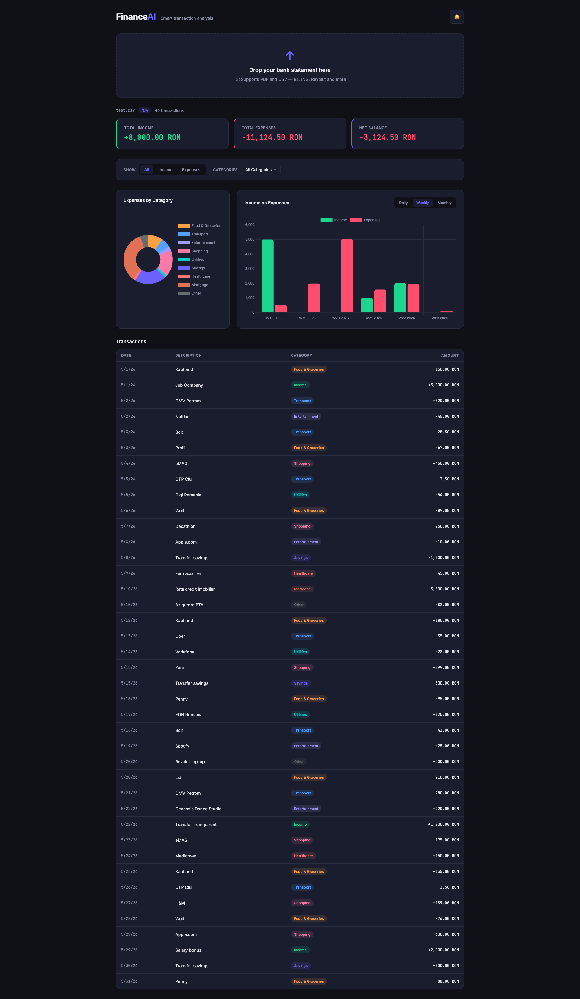
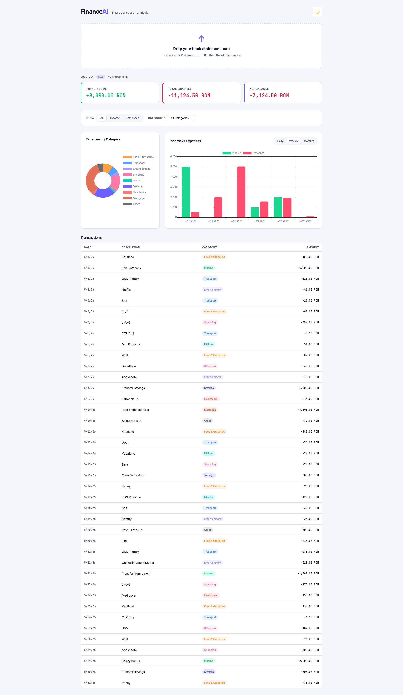
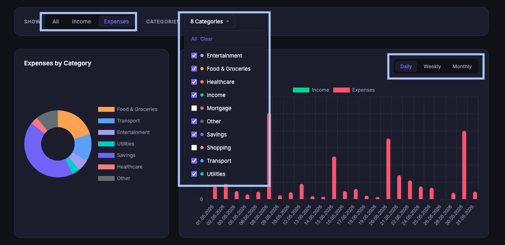
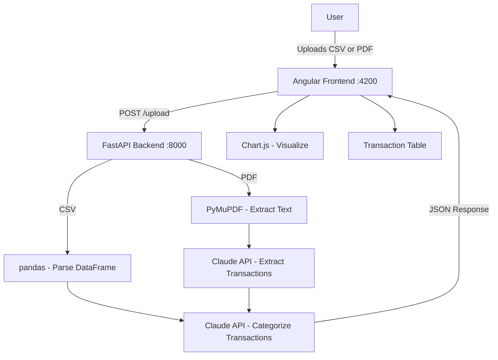

# FinanceAI 💸

> A personal finance dashboard powered by AI — upload your bank statements and get instant transaction categorization, visual analytics, and spending insights.


---

## 📸 Screenshots

### Upload Zone



### Dashboard (Dark Theme)



### Dashboard (Light Theme)



### Filtered View



> Filters apply to both charts and the transaction table below.

---

## ✨ Features

- **Smart Upload** — drag & drop CSV or PDF bank statements; file type is auto-detected
- **AI Categorization** — transactions are automatically categorized using Claude (Anthropic) into 10 categories: Food & Groceries, Transport, Entertainment, Utilities, Healthcare, Shopping, Income, Savings, Mortgage, Other
- **Multi-bank PDF Support** — parses statements from BT (Banca Transilvania), ING, BCR, BRD, Raiffeisen, and Revolut; unknown formats fall back to Claude for extraction
- **Interactive Charts** — doughnut chart for expense breakdown by category; bar chart for income vs expenses with Daily / Weekly / Monthly aggregation toggle
- **Filters** — filter by direction (All / Income / Expenses) and by one or more categories simultaneously; filters apply to both charts and the transaction table
- **Dark / Light Theme** — toggle between themes; dark is the default
- **Summary Cards** — total income, total expenses, and net balance update in real time based on active filters

---

## 🏗️ Architecture



---

## 🛠️ Tech Stack

| Layer       | Technology                     | Notes                                                   |
| ----------- | ------------------------------ | ------------------------------------------------------- |
| Frontend    | Angular 19                     | Standalone components, no NgModules                     |
| Charts      | Chart.js                       | Used directly — ng2-charts incompatible with Angular 19 |
| Styling     | SCSS + CSS Variables           | Dark/light theme via `data-theme` attribute             |
| Backend     | FastAPI (Python 3.12)          | Async endpoints, automatic OpenAPI docs at `/docs`      |
| PDF Parsing | PyMuPDF                        | Text extraction from bank statement PDFs                |
| CSV Parsing | pandas                         | DataFrame-based parsing                                 |
| AI          | Claude API (claude-sonnet-4-6) | Transaction extraction and categorization               |
| Testing     | pytest + httpx                 | Unit tests and integration tests with mocked Claude API |
| CI          | GitHub Actions                 | Runs on every PR: ruff linting + pytest + Angular build |

---

## ⚙️ Getting Started

### Prerequisites

- Python 3.12+
- Node.js 18+
- Angular CLI 19
- Anthropic API key

### Backend

```bash
cd backend
python -m venv .venv
source .venv/bin/activate
pip install -r requirements.txt
```

Create a `.env` file in the `backend` folder:

```
ANTHROPIC_API_KEY=your_api_key_here
```

Start the server:

```bash
uvicorn main:app --reload
```

API available at `http://localhost:8000` — interactive docs at `http://localhost:8000/docs`

### Frontend

```bash
cd frontend
npm install --legacy-peer-deps
ng serve
```

App available at `http://localhost:4200`

---

## 🧪 Testing

```bash
cd backend
pytest tests/ -v
```

19 tests covering:

- Unit tests: `detect_bank`, `parse_csv_transactions`
- Integration tests: all endpoints with mocked Claude API

---

## 🔧 Known Challenges

| Challenge                                    | Solution                                                                           |
| -------------------------------------------- | ---------------------------------------------------------------------------------- |
| `ng2-charts` incompatible with Angular 19    | Used Chart.js directly                                                             |
| `@angular/material` peer dependency conflict | Installed with `--legacy-peer-deps`                                                |
| Charts rendering in infinite loop            | Added `lastTransactionCount` flag — re-renders only when transaction count changes |
| Claude API returns markdown-wrapped JSON     | Strips ` ```json ``` ` fences before parsing                                       |
| PDF token usage high for long statements     | Set `max_tokens=16000`; pre-processing planned as future optimization              |

---

## 🗺️ Roadmap

- [ ] PDF pre-processing to reduce Claude API token usage
- [ ] CD pipeline — auto-deploy on merge to `main`
- [ ] Support for multi-month analysis across multiple uploads
- [ ] Export filtered transactions to CSV

---

## 👤 Author

**Codrut Lucian Margin**  
[GitHub](https://github.com/codrutlucianm) · Cluj-Napoca, Romania
